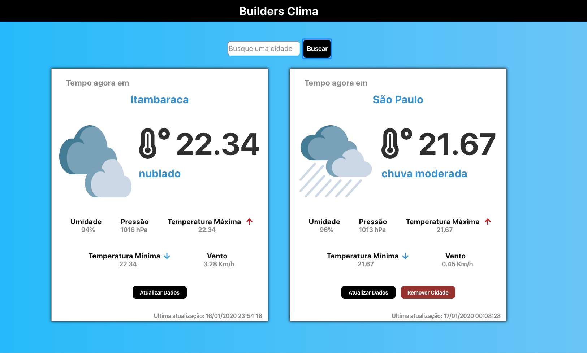
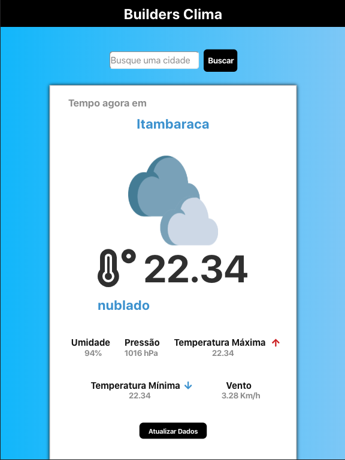
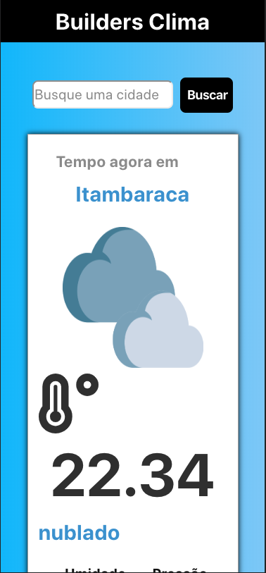
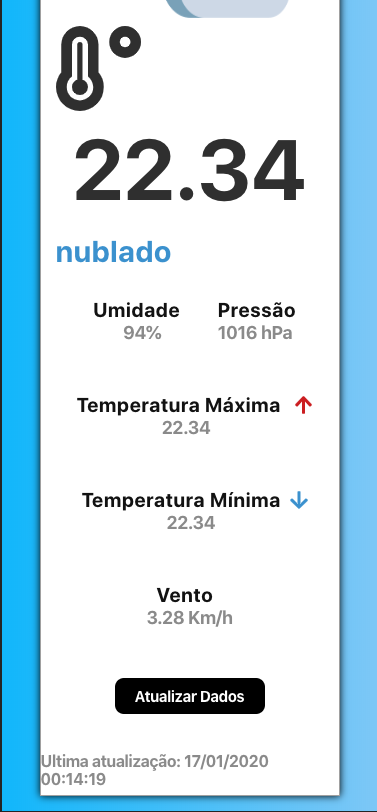

### Builders Clima

Essa aplicação é um simples demonstrativo de utilizar uma api para obter os dados do clima onde o usuário está localizado e exibir os dados do clima dessa localização, utilizando api de geolacalização do navegador.

É possível ver o clima da sua localização atual, e também buscar uma cidade específica para visualizar o clima de onde você quiser. =)

#### Bibliotecas utilizadas construção do projeto

- React
- Axios
- Moment
- Redux
- Redux-Saga
- Styled Components
- FontAwesme
- React Toastify

#### Como rodar o projeto?

Basta criar um arquivo .env na raiz do projeto, seguindo o .env.example. Instalar as dependências com o comando `yarn`, e por fim basta rodar `yarn start`.

#### Layout

##### Web

##### Tablet

##### Celular

